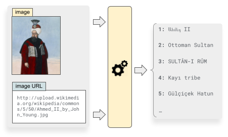

# Transformer-Based Multi-modal Proposal and Re-Rank for Wikipedia Image-Caption Matching

This repo contains the code for reproducing the results obtained by our team _FanDani_ at the [Wikipedia Image/Caption Matching Challenge](https://www.kaggle.com/c/wikipedia-image-caption/overview).

## Updates
- 25/03/2022: Our paper _Transformer-Based Multi-modal Proposal and Re-Rank for Wikipedia Image-Caption Matching_ has been accepted at the [Wiki-M3L](https://meta.wikimedia.org/wiki/Wiki-M3L) workshop, colocated with [ICLR 2022](https://iclr.cc/).
- 31/03/2022: The code is publicly released!

## Organization

This repo is organized into two modules, as explained in the paper:
- The **The Multi-modal Caption Proposal (MCProp)** network, which uses k-nn in a shared image-caption space to efficiently retrieve the top-k captions given image data;
- The **Caption Re-Rank (CRank)** network, which uses a large pre-trained textual transformer to exhaustively and effectively score the captions proposed by the MCProp network.

These are two separate modules located in the `mcprop` and `crank` folders respectively. You can find installation and run instructions in the `README.md` files inside these folders.

## Citation
If you find this work useful for your research, please cite our paper:

    @article{messina2022transformer,
      title={Transformer-Based Multi-modal Proposal and Re-Rank for Wikipedia Image-Caption Matching},
      author={Messina, Nicola and Coccomini, Davide Alessandro and Esuli, Andrea and Falchi, Fabrizio},
      journal={arXiv e-prints},
      pages={arXiv--2206},
      year={2022}
    }
