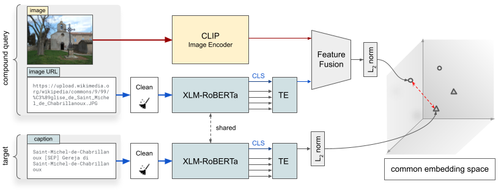

# The Multi-modal Caption Proposal (MCProp) Network

The Multi-modal Caption Proposal (MCProp) Network aims at learning a compact common space where the visual information can be used to easily search for candidate captions. This space is embedded with cosine similarity, and efficient k-nn search is performed to retrieve the top-k relevant captions.

<p align="center">

</p>

## Installation
First, clone this repo and move into it.

Create a new conda environment from `environment.yml`:
```bash
conda env create --file environment.yml
conda activate mcprop
export PYTHONPATH=.
```

## Download Data
Download and extract pre-built data:
```
TODO: download data.tar.gz
tar -xvf data.tar
```

## Extract Images from CSVs
_Note: this step is required only if you want to also use images to train the network_

TODO

## Train

### Without images:
To train the model **without using image data**, use the following command:
```
python train.py --config configs/baseline_maxviolation.yaml --data_dir data --val_step 4000 --logger_name runs/baseline_maxviolation --workers 5 --train_subfolder full
```
This training uses all the available data rows, even the ones that have broken URLs.

### With images:
Notes:
- you need to first extract the images as explained above in the folder pointed by the option `--img_cache`.
- _WARNING: If you do not provide a correct `--img_cache` path, the dataloader will automatically try to download the images from the web, following the URLs, caching them on disk. This could significantly slow down the training process._

To train the model **with images** from scratch, use the following command:
```
python train.py --config configs/baseline_maxviolation_images_weighted-fusion.yaml --data_dir data --val_step 4000 --logger_name runs/baseline_maxviolation_images_weighted-fusion --workers 5 --train_subfolder only_with_images --img_cache /path/to/img/folder
```

Final training notes:
- The path pointed by `--logger_name` collects best models and training-validation statistics, which can be inspected using Tensorboard.
- If you experience instabilities during training, you can first train without images using the `baseline.yaml` configuration, which does not use hard negative sampling. Once pre-trained, you can then fine-tune this model, loading it using the `--load_model runs/path/to/model/model_best_fold0.pt` option in the previous commands.

## Inference
To perform inference on the validation set, you can use the following command:
```
python inference.py --data_dir data --checkpoint runs/path/to/experiment/model_best_fold0.pt --img_cache /path/to/images --k 1000 --bs 32 --set val 
```


Other useful option configurations (they mostly make sense with `--set test`):
- `--submission_file submission.csv` is used to produce the csv file that can be submitted to the challenge;
- `--output_indexes indexes_path` creates a folder `indexes_path` with csv files containing, for each query, a list of ranked caption ids. This can be used to produce files for filtering the candidates for the CRank module.
